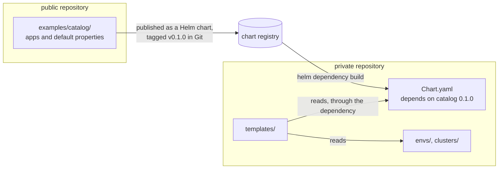

# layout

Renders the Argo CD Applications of one cluster from a layout whose catalog lives in another repository.

This directory is a layout whose catalog lives in another repository. It
stands for a private repository holding confidential environments and
clusters, while the catalog stays public. Read [examples/](../examples/)
first: this layout works the same way, and this page only covers what the
split changes.

## What lives where



- **The catalog is a Helm dependency**, declared in [Chart.yaml](Chart.yaml)
  and pinned to a version. Upgrading the catalog is changing that version;
  nothing else in this repository mentions it. Here the dependency points at
  [examples/catalog/](../examples/catalog/) through a `file://` path, so the
  example works from one checkout; a real private repository points at the
  registry the catalog is published to.
- **This repository holds only its environments and clusters**:
  [envs/acme/](envs/acme/) runs cert-manager and Grafana on `aws-1`, and
  [clusters/aws-1/](clusters/aws-1/) adapts them to AWS — its own secret store,
  its own ingress class.
- **The wiring is the same chart** as in [examples/](../examples/), shared
  through symbolic links; a real private repository would take it as a Helm
  dependency too. It finds the catalog in the dependency instead of a
  `catalog/` directory, and nothing else changes.

## What the Applications fetch

The chart reads the catalog's files from the dependency, but Argo CD still
needs the catalog's values files and manifests when it renders each
Application. It fetches them from the catalog's Git repository, at the tag
matching the dependency's version, `v0.1.0`. `acme-cert-manager-aws-1` in
[rendered/aws-1.yaml](rendered/aws-1.yaml) shows it:

- its values file comes from `$catalog/…`, a second Git source at `v0.1.0`;
- its manifests stack two layers: the catalog's, fetched from the public
  repository at `v0.1.0`, then the patch of
  [clusters/aws-1/overrides/cert-manager/](clusters/aws-1/overrides/cert-manager/)
  from this repository.

Argo CD must therefore reach the catalog's registry and its Git repository.
The tag `v0.1.0` is illustrative here: this repository has no such tag.

## Bootstrapping

As in [examples/](../examples/README.md#bootstrapping), from this directory,
with the cluster running Argo CD being `aws-1` and the dependency fetched
first:

```sh
helm dependency build .
```

```sh
helm template layout . --set cluster=aws-1 --set layout.repoURL=https://github.com/therealm-tech/argocd-layout-spec --set layout.targetRevision=HEAD --set layout.path=examples-confidential | kubectl apply -n argocd -f -
```

```sh
argocd app sync platform-layout-aws-1
```

The ApplicationSet it deploys comes from the catalog, and points at this
layout thanks to the `layoutPath` property of
[envs/platform/properties.yaml](envs/platform/properties.yaml).

## Values

| Key | Type | Default | Description |
|-----|------|---------|-------------|
| argocdNamespace | string | `"argocd"` | Namespace Argo CD reads Applications from. |
| cluster | string | `nil` | Name of the cluster to render, identical in Argo CD and in the layout. |
| layout | object | `{"path":null,"repoURL":null,"targetRevision":null}` | Where the generated Applications read the layout from. |
| layout.path | string | `nil` | Path of the layout root inside the repository. |
| layout.repoURL | string | `nil` | Git URL of the repository holding the layout. |
| layout.targetRevision | string | `nil` | Revision of the layout the generated Applications track. |
| project | string | `"default"` | Argo CD project of the generated Applications. |
