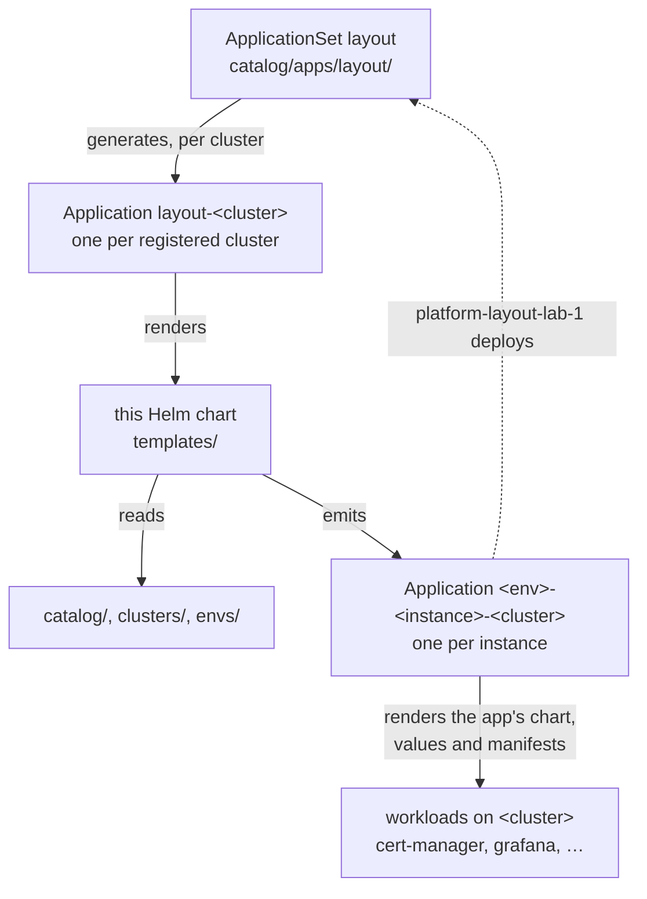

# layout

Renders the Argo CD Applications of one cluster from the layout around it.

This directory is a complete layout following [SPEC.md](../SPEC.md): a
catalog, two clusters and three environments, plus the small Helm chart that
turns it into Argo CD Applications. This page walks through how the pieces fit,
assuming little prior knowledge of Argo CD.

## Argo CD in a nutshell

Argo CD runs in a Kubernetes cluster and keeps other clusters (and its own) in
line with what a Git repository describes. Three of its objects matter here:

- An **Application** says *what* to deploy and *where*: one or more sources (a
  Helm chart, a directory of manifests in Git) and a destination (a cluster and
  a namespace). Argo CD renders the sources, compares the result with the
  cluster, and applies it when you **sync** the Application.
- An Application can deploy anything, including **other Applications**. An
  Application whose sources render Application manifests is often called an
  *app of apps*: syncing it creates or updates the Applications it describes.
- An **ApplicationSet** generates Applications from a template, here one per
  cluster registered in Argo CD.

Nothing in this example syncs on its own: every Application shows what would
change, and applies it when someone syncs it.

## How the pieces fit



1. The **ApplicationSet `layout`** creates one Application `layout-<cluster>`
   per cluster Argo CD knows. It is itself an app of the catalog,
   [catalog/apps/layout/](catalog/apps/layout/), installed by the `platform`
   environment on `lab-1`, the cluster running Argo CD: the layout deploys its
   own wiring (the dotted arrow).
2. Each **`layout-<cluster>`** renders this chart for its cluster. The chart
   reads `envs/*/env.yaml`, keeps the environments placed on that cluster, and
   for each of their instances merges the configuration layers.
3. The chart emits one **Application per instance**, named
   `<env>-<instance>-<cluster>`. Syncing it deploys the instance: its chart
   with the merged values, and its manifests with the patches of every layer.

[templates/](templates/) is the whole chart. A mistake in the layout — an
undefined property, an instance that resolves to no app — fails the render of
`layout-<cluster>`, so the error shows in Argo CD before anything is applied.

## Following one instance

Take Grafana in the `prod` environment on the air-gapped cluster `airgap-1`.

**It is declared.** [envs/prod/env.yaml](envs/prod/env.yaml) places `prod` on
`lab-1` and `airgap-1` and lists `grafana` among its instances. With no `app:`
field, the instance is the catalog app of the same name.

**Its layers are found**, from the most generic to the most specific; any of
them may be missing:

| Layer | Directory | What it adds here |
| --- | --- | --- |
| default | [catalog/apps/grafana/](catalog/apps/grafana/) | the chart, default values, an `ExternalSecret` for the admin password |
| environment | [envs/prod/instances/grafana/](envs/prod/instances/grafana/) | values for every `prod` cluster |
| cluster | `clusters/airgap-1/overrides/grafana/` | nothing: the directory does not exist |
| placement | [envs/prod/clusters/airgap-1/instances/grafana/](envs/prod/clusters/airgap-1/instances/grafana/) | a `ConfigMap` and values for `prod` on `airgap-1` only |

**Its properties are resolved**, in the same order: the catalog's defaults,
then `prod`'s, then `airgap-1`'s, then the placement's. `prod` points Docker
images at a public mirror, but `airgap-1` cannot reach it and points them at
its Harbor registry; the cluster is more specific than the environment, so
Harbor wins. The catalog app says where each property lands: the chart's
registry, a Helm parameter, a field of the `ExternalSecret`.

**The Application comes out** as `prod-grafana-airgap-1` in
[rendered/airgap-1.yaml](rendered/airgap-1.yaml):

- the Grafana chart, pulled from the Harbor mirror;
- the values files of every layer, in order, read from this repository;
- `global.imageRegistry` set to Harbor, and the `ExternalSecret` switched to
  the cluster's secret store;
- the manifests of every layer stacked on [base/](base/), an empty Kustomize
  base.

## Bootstrapping

Argo CD must run on `lab-1`, and every cluster must be registered in it under
its layout name. The cluster running Argo CD is registered too, so that the
ApplicationSet sees it:

```sh
argocd cluster add <lab-1-context> --name lab-1 --in-cluster
```

```sh
argocd cluster add <airgap-1-context> --name airgap-1
```

Then, from this directory and with `kubectl` pointed at `lab-1`, render the
Applications of `lab-1` once by hand, and sync the one that deploys the
ApplicationSet (the Sync button in the Argo CD UI does the same):

```sh
helm template layout . --set cluster=lab-1 --set layout.repoURL=https://github.com/therealm-tech/argocd-layout-spec --set layout.targetRevision=HEAD --set layout.path=examples | kubectl apply -n argocd -f -
```

```sh
argocd app sync platform-layout-lab-1
```

From there the ApplicationSet creates `layout-lab-1` and `layout-airgap-1`,
which take over the Applications applied by hand.

## Everyday changes

Each change is a commit, then a sync of `layout-<cluster>` to update the
Applications, then a sync of the Applications that changed.

- **Install an app in an environment**: add it under `instances:` in the
  environment's `env.yaml`.
- **Install an app twice**: two instances with the same `app:`, as `ceph-hdd`
  and `ceph-ssd` in [envs/prod/env.yaml](envs/prod/env.yaml).
- **Skip an instance on one cluster**: list it under that cluster's
  `disabled:` in `env.yaml`.
- **Change a value everywhere, for one environment, one cluster, or one
  environment on one cluster**: edit `values/<source>.yaml` in the matching
  layer of the table above.
- **Change what a cluster can reach** (a registry, a secret store): edit its
  `clusters/<cluster>/properties.yaml`.
- **Add a cluster**: register it in Argo CD, create `clusters/<cluster>/` if it
  needs anything specific, and list it under `clusters:` in the environments
  placed on it.

[examples-confidential/](../examples-confidential/) is a second layout, with
its own environments and clusters, that uses this catalog from another
repository — for clusters whose configuration must stay private.
[catalog/Chart.yaml](catalog/Chart.yaml) is what lets it: it packages the
catalog as a Helm chart.

## Values

| Key | Type | Default | Description |
|-----|------|---------|-------------|
| argocdNamespace | string | `"argocd"` | Namespace Argo CD reads Applications from. |
| cluster | string | `nil` | Name of the cluster to render, identical in Argo CD and in the layout. |
| layout | object | `{"path":null,"repoURL":null,"targetRevision":null}` | Where the generated Applications read the layout from. |
| layout.path | string | `nil` | Path of the layout root inside the repository. |
| layout.repoURL | string | `nil` | Git URL of the repository holding the layout. |
| layout.targetRevision | string | `nil` | Revision of the layout the generated Applications track. |
| project | string | `"default"` | Argo CD project of the generated Applications. |
